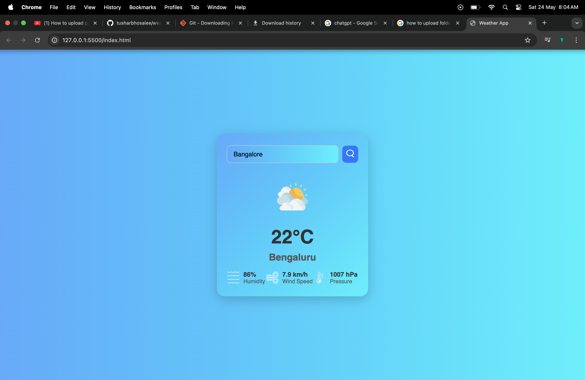

# Weather App

## Overview
A responsive weather application built with HTML, CSS, and JavaScript. It fetches live weather data from the OpenWeatherMap API and displays temperature, humidity, wind speed, and pressure for any city.

#Screenshot

## Features
- Real-time weather data with error handling.
- Responsive design for desktop and mobile devices.
- Accessibility enhancements for screen readers and keyboard navigation.
- Smooth animations and transitions for better UX.
- Custom Google Fonts and intuitive UI.

## How to Use
1. Enter a city name in the input box.
2. Press the search button or hit "Enter".
3. Weather details for the city will be displayed.

## Technologies Used
- HTML5
- CSS3 (Flexbox, animations, media queries)
- JavaScript (Fetch API, async/await)
- OpenWeatherMap API

## Challenges & Learnings
- Implementing proper error handling and UI feedback.
- Managing async API calls and DOM updates.
- Designing a responsive and accessible UI.
- Using semantic HTML and ARIA roles for accessibility.

## Future Improvements
- Add city auto-complete suggestions.
- Implement caching to reduce API calls.
- Enhance UI with SVG icons and dark mode support.
